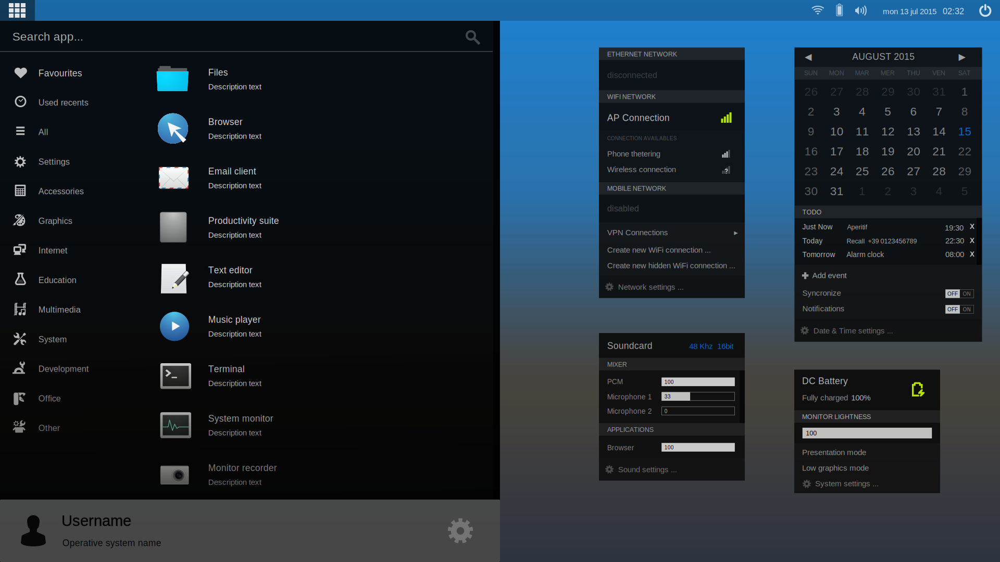

# Squishmatic project

 

 

###### Draft

## The idea

The main idea is to create a *new system environment* to exploit the whole potentiality of _augmented reality_ and _mixed reality_, which works almost everywhere, cross-platform, reusing existing applications. At his base: virtualization and containers, each application should have a sandbox and reuse the same context when this is possible, to avoid an excessive resources utilization.

The system environment must _look like an OSD_, drawing 2D components in the three-dimensions with only *depth* and *colors*, this is need because the system should be an utility rather than an additional unwieldy environment to interact with. The _2D components_ of the user interface _could be morphed from 2D to 3D_ when the user interact with them, for example an icon at the time of launching a particular action can transpose from 2D to 3D.

 

### 2D + 3D: augmented reality, mixed reality and desktop together

Nothing to invent, the wheel already exists, it is the _simple mixing of virtual and real environment_, the wallpaper disappears and a room is the real environment, the virtual desktop become the desktop of a real room, I can login really on my home desktop or in the desktop in my office, handling real documents and applying them virtual tags, or virtual documents with the icon that will be transformed from 2D to 3D.

 

### Domotic applications: the real meets the virtual

More than focusing efforts on the development of new desktop features, it would be necessary make purchasables *virtual components and domotics* for mixed reality. A practical example: the recycle bin, when I ask for recycle bin, I have a *robotic recycle bin* or a lot of robotic recycle bins, click on the 2D icon and attend it arrive, check its virtual and digital contents, set when it needs emptying or ready to recycling and others real and virtual application fields.

This paradigm is applied to *real and virtual objects* like the recycle bin or to the office drawer unit, bookcase, lighting, plants and flowers, smart speakers. You could add utilities for both environments, as example the classic Note / Memo or where did I leave the keys?.

Returning to the disappeared wallpaper, I could open my 3D wallpaper library, put a real picture (which could also be a purchasable home automation component), a specific point in a room then add a virtual image within, a 3D reproduction of work of art or explorable natural locations. Concrete or virtual actions could be also monetized.

 

## How to …

You need a fairly *advanced window manager* to handle *levels of zIndex depth* and *support 2D and 3D rendering*, extra features will be rendered with specific *extensions*. The transformations from simple 2D to mixed 2D / 3D application fields are applied through the extensions, without having to overturn and weigh down *existing softwares*. Still starting from a pre-existing authentication layer you need to extend it, so it is possible to have *cross-platform*, *augmented reality* and *interaction with domotic components*.

The _system environment should provide the orchestration of common operations in the real environment_ like read a book, a software manager manage and controll all these steps and domotics components IoT, the sofa is recognized in a real space, I select my real or virtual book from the Books software, I sit down, the lights are dimmed in the right intensity for reading, I quietly leaf through my book, maybe accompanied with a music in background that is same provided by another software.

When the system environment is not used in augmented mode, everything should look like a traditional desktop, *intuitiveness* is a main factor and _a certain compatibility with the augmented mode should persist_, for example when a window is maximized the top bar collapses, the elements in the window bar are slightly shifted to give perception of depth in 2D. This require to *remove unnecessary frills*, put advanced features in a special menu, you don't need 3 or 4 buttons to maximize / minimize / close a window, now left as a reference only, 2 are enough and intuitive: X and Ʌ / V. Most of the components of interfaces have a minimum size in order to be used both in laptop and handset contexts, having a tablet as reference, mobile devices like smartphone have different approach and straitened market. Best thing would be to conceive interfaces with the same approach used in the web with the *responsive design*.

 

### The starting point: Xfce and some Gnome apps

As a starting point, I would use the DE Xfce, because it is *lightweight* and equipped with ready to use softwares, these have been ported to gtk3 and this greatly facilitates in the developing of a theme. I would adopt the Thunar file manager that can handle files quickly, along with some excellent software from Gnome, for example gnome-system-monitor and gnome-disk-utility, well designed and with less dependencies. An ad-hoc settings manager is needed to handle preferences from different DEs. In the near future it could be possible to develop a new DE with at his base the rendering engine of a browser, perhaps, and using existing applications of various DEs.

All the design elements must be as intuitive as possible, starting from the elementary-icons iconset, the gnome-icon-theme and others that lend themselves well to this purpose (links to resources [here](luma-theme_design/COPYING)), making each icon more modern and appealing, removing all fxs and shadows which should be intelligently handled with compositing by the window manager.

 

### Virtualization, containers, sandboxed software, cross-platform

Concerning virtualization, could be used existing virtualization and containerization systems to ensure *this system will available almost anywhere* regardless to the os you are using, allowing native applications together with containerized applications and vice versa. This to not vanify the efforts in a great number of softwares even better and better than most well-liked, and to not create a _yet another desktop_.

So this new system environment should be tested with _a simple software installation_, _fully adopted as a software in an pre-existing operating system in embedded mode_ and finally available as a distro. The most important thing is _the closer proximity to perfection_ and _the simplicity of use_, so no instability, error windows, TODO messages, to implement messages, etc.

 

### The last tip

Combining this system environment with _an innovative wearable 3D viewer device_, light, not bulky and also sweet and comfortable to wear, together with _home automation components_ from Internet of Things or a full system for home or office, could be a great strength for its diffusion.

 

Nothing utopian, only persons willing, capable, able to pursue a common goal are needed.

 

## Roadmap

There is a partial TODOLIST here: [TODOLIST.md](TODOLIST.md)

- Luma theme
- Spectrum iconset

 

### Get involved

Join the team: [https://github.com/orgs/squishmatic/teams](https://github.com/orgs/squishmatic/teams)

***

You can open issues to request features, report bug, or send a Pull Request.

 

### License

This documentation is published under the terms of Creative Commons - Attribution-ShareAlike 4.0 International.

[CC-BY-SA-4.0](LICENSE)
